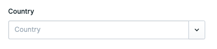
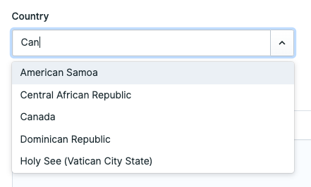
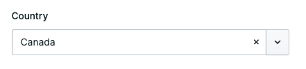
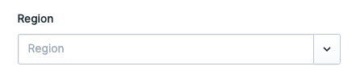
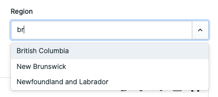
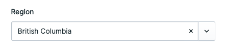
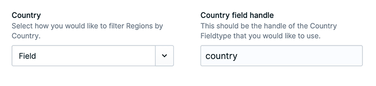
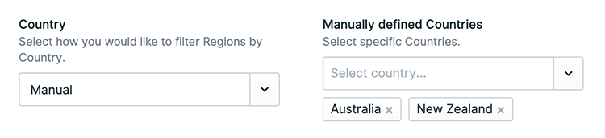
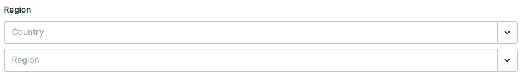

# Statamic Country And Region Fieldtypes

> Statamic Country And Region Fieldtypes is a Statamic addon that is everything you need to store and display country and region on your Statamic site.

## Features

- Supports all Countries standardized in `ISO 3166-1`.
- Supports all Regions standardized in `ISO 3166-2` (Principle subdivisions; for example: State, Province).

- Multiselect Countries and Regions.
- Set a default Country or Region.
- On the Region fieldtype configure one or multiple Countries whose Regions to display as options.

- Locale for these Fieldtypes work in Control Panel.
- When using multisite these fieldtypes will display the country or region in the locale of the (multi) site.

## How to Install

Search 'Country and region' addon in the `Tools > Addons` section of the Statamic control panel and click **install**.

Or run the following command from the root of your project:

```bash
composer require kadegray/statamic-country-and-region-fieldtypes
```

## How to Use

You will notice that there are multiple Fieldtypes, this is to give you the most control over how you would like to store your data. You may want to separate Country and Region or combine them with the Region in Country Fieldtype.

- Country Fieldtype
- Region Fieldtype
- Region in Country Fieldtype

### Country Fieldtype

After adding the Country Fieldtype to your blueprint, when editing an entry it will display as a select input. On saving the entry this fieldtype saves the country code as the value rather than the country name.







If you named the field `country`, then in the anter template you would use the following to render the Country name.

```
{{ country }}
```

If you are using multi site then the above will render the Country in the language of the locale of the given site you are on.

### Region Fieldtype







The Region Fieldtype is much the same as the Country Fieldtype above, except you have to configure `Country` on the Fieldtype. This tells the Region Fieldtype what countries regions to show in the select.

The `Country` config has two options:

1. **Manual** - This is where you manually select a Country.
   
1. **Field** - With this option you then define the handle of a Country Fieldtype in the same blueprint. Which means that when a country in the Country Fieldtype is selected it will cause this Region Fieldtype to update its list of regions to those of the country selected.
   

### Region in Country Fieldtype

The Region in Country Fieldtype is simply the Country Fieldtype and Region Fieldtype combined. The Country needs to be selected before the Region can be selected, it updates the options in the Region Fieldtype.


## Locale configuration

### Control Panel

The Fieldtype on pages in the control pabel support the locale. Meaing that if you change the locale for the control panel, then these Fieldtypes will display in the appropriate language.

To configure the locale of control panel, you need to set `locale` inside of `config/app.php`. Remember to `php artisan config:clear`.

### Multi site

When using multi site, rendering a fieldtype with Antlers `{{ region }}` will render the value (Country or Region) in the sites locale language.

These locales are configured in `config/statamic/sites.php`.
